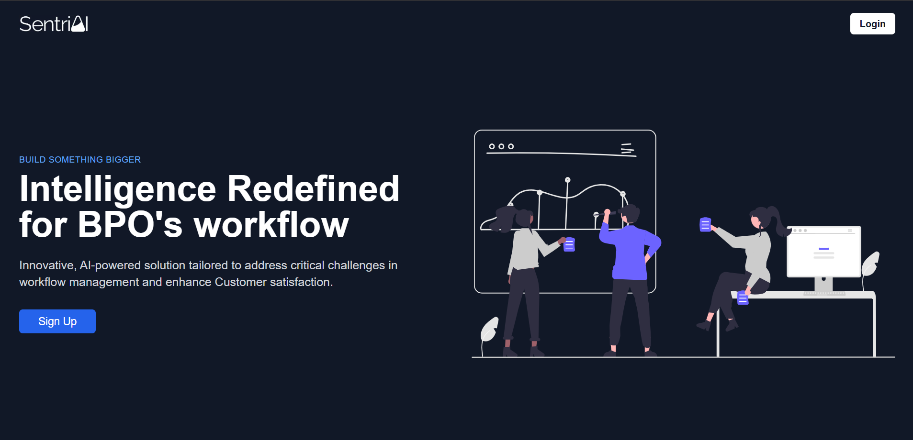
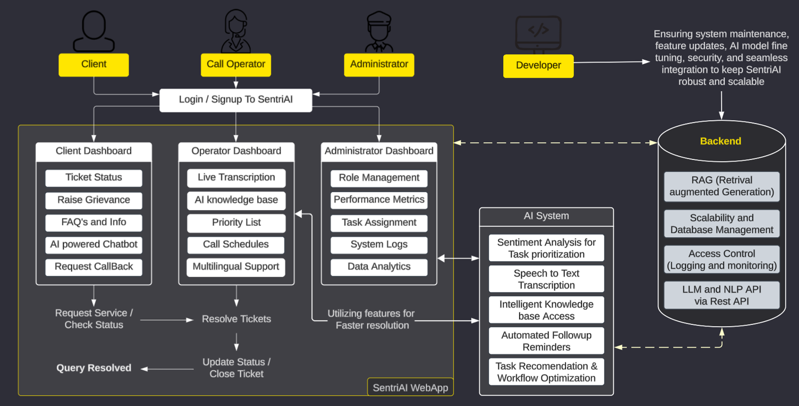

# **<p align="center">Sentri AI – Intelligent BPO Automation</p>**
SentriAI is a cutting-edge platform designed to revolutionize BPO workflows through intelligent task prioritization and a robust **AI-powered knowledge base**. By streamlining operations and enhancing efficiency, SentriAI empowers employees to resolve issues swiftly, ensuring exceptional productivity and seamless customer experiences. It’s the ultimate solution for modernizing business operations.

<p align="center">
    
</p>

## ✨ Features  
- **AI Knowledge Base** – Gemini-powered RAG fetches accurate responses.  
- **Role-Based Dashboards** – Tailored views for clients, operators, and admins.  
- **Automated Ticketing & Resolution** – NLP-based sentiment analysis prioritizes tasks.  
- **Multilingual Transcription** – Converts voice messages into actionable text.  

## 👨‍💻Tech Stack  
- **Frontend**: Next.js, TypeScript, Tailwind CSS, Framer Motion
- **Backend**: Langchain, Mixbread AI, Google Gemini-1.5-Pro, FastAPI
- **Database**: Pinecone (Vector DB)
- **AI/NLP**: NLP-based sentiment analysis, RAG for document retrieval

## 📊 How It Works
<table>
  <tr>
    <td width="55%">
      
    </td>
    <td width="55%">
      <ul>
        <li><strong>Admins</strong> upload relevant documents and manage the knowledge base.</li>
        <li><strong>Operators</strong> use the AI-powered search to fetch accurate information.</li>
        <li><strong>Clients</strong> generate tickets via text/voice.</li>
        <li><strong>The system</strong> automates workflow handling, improving efficiency.</li>
      </ul>
    </td>
  </tr>
</table>


## Setup  
*API keys for Gemini, Pincone and hugging token required
```sh
# Clone the repository
git clone https://github.com/Hari-1903/SentriAI.git  
cd SentriAI

# Install dependencies
npm install  

# Run the app
npm run dev  
